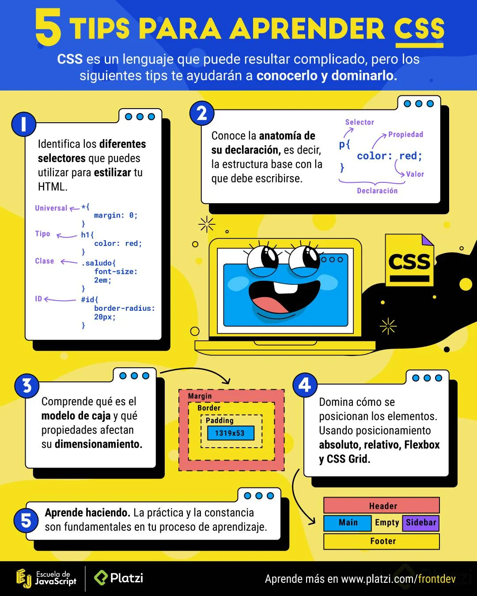

# Introducción

## **La internet**
La internet nació en los 80 es un conjunto de dos palabras 
Interconnected y Network
Red inmensa de computadoras conectadas a través del mundo

## **Consorcio W3C**
Estandar de las tecnologías utilizadas para el buen uso de la internet

* HTTP - Protocolo de transferencia de hipertexto

* URL - Localizador de Recursos Uniforme

* HTML - Lenguaje de marcado de hipertextos

## **¿Qué es HTML y CSS?**

- ### ***HTML***
    > Html es una lenguaje de marcado para decirle al navegador cómo estructurar las páginas web que se visitan. No es un lenguaje de programación.

- ### ***CSS***
    > CSS es un lenguaje que permite crear páginas web con un diseño agradable para los usuarios. Tampoco es un lenguaje de programación.

- ## ***DOM***
    > Documento Object Model es una transformación del código HTML escrito por nosotros a objetos entendibles para el navegador

- ## ***CSSOM***
    > Así como el DOM para el HTML, EL CSSOM es una representación de objetos de nuestros estilos en CSS.

- ## ***Render Tree***
    > Es la unión entre el DOM y el CSSOM para renderizar todo el código de nuestra página web.

## **Pasos que sigue el navegador para construir las páginas web**

1. Procesa el HTML para construir el DOM
2. Procesa el CSS para construir el CSSOM
3. El DOM se une con el CSSOM para crear el Render Tree
4. Se aplican los estilos CSS en el Render Tree
5. Se "Pintan" los nodos en la pantalla para que el usuario vean el contenido de la página web.

# Tips para aprender CSS

# Anatomía de un elemento HTML
> **Los elementos HTML se componen de:**
    >> - ***Etiqueda de apertura:*** El nombre de nuestra etiqueta encerrado entre símbolos de mayor o menos. Por ejemplo `<h1>`
    >> - ***Contenido:*** Dentro de nuestras etiquetas podemos añadir texto u otros elementos HTML, lo que conocemos como anidamiento.
    >> - ***Etiqueta de cierre:*** Son casi iguales que los contenidos de apertura pero también necesitan un slash (/) antes del nombre de la etiqueta por ejemplo `</h1>`

**Ejemplo**

    
 
        <a> Esto es un link dentro de un parrafo </a>
    

- Las etiquetas de apertura también pueden tener atributos. Los atributos nos permiten definir características especiales para nuestros elementos. \<etiqueta atributo="Valor del atributo">. Por ejemplo 
`<h1 class="saludo">`

- También existen elementos vacíos. Estos elementos no tienen contenido ni etiqueta de cierre, solo etiqueta de apertura y atributos. Por ejemplo: 
``

# Terminos CSS 

## Displays

- Block
    - Representa al flujo que tenemos cada que escribimos. Por ejemplo, nosotos escribimos de izquierda a derecha, pero cuando se nos acaba el espacio horizontalmente, seguimos abajo. Este es el flujo de bloque, en nuestra escritura (de arriba a abajo) y es exactamente el que obedece display block, lo que quiere decir que los elementos se visualizan uno debajo del otro.
- Inline
    - Representa a la línea base que seguimos para escribir, que en el caso del latín es de izquierda a derecha. Por lo tanto, todos los elementos con este display se visualizarán uno del lado del otro de izquierda a derecha.
    
    - Algunos elementos que por defecto tienen este tipo de display son: \  \<em> y \<b>

- Inline-block 
    - Este display es muy similar al display inline, sin embargo este respeta el width y el height que se le asigne a los elementos.

- None
    - Este display es utilizado para ocultar elementos sin eliminarlos por completo del DOM.

- Table
    - Los elementos con este display se comportan como los elementos \<table>

- Flex
    - Centra elementos, alinearlos a la derecha o a la izquierda, siempre ha sido una tarea difícil. Sin embargo, llega flexbox para ayudarnos con este dilema. Para usar flexbox es **Indispensable** la propiedad **display**: flex en el elemento padre que por defecto alineará los elementos hijos de izquierda a derecha. También, este display suele acompañarse por otras propiedades como justify-content y align-items.

    - Trabajar con flexbox no basta sólo con escribir *display: flex*, también es muy importante que entendamos cómo funciona y para ello se puede dar una revisada a la siguiente documentación: 
    
    - https://css-tricks.com/snippets/css/a-guide-to-flexbox/

- Grid
    - Después de flexbox, llega el más poderoso sistema de layout: CSS Grid y para implementarlo debemos hacer uso de display: grid en el elemento contenedor o elemento padre.

    - Al igual que con el flexbox, CSS Grid requeire de un estudio adicional ya que no basta con colocar este display. Para ello, está la siguiente documentación: 

    - https://css-tricks.com/snippets/css/complete-guide-grid/

## Funciones de las propiedades CSS más usadas

- **Width:** Define el ancho de los elemento. Por ejemplo ` width: 20px;`

- **Height:** Define el alto de un elemento. Por ejemplo `height: 20px;`

- **Background:** Puede definir el color de fondo o la url de fondo de un elemento. Por ejemplo: `background: url(':puppy.png';)`

- **backgorund-color:** Define el color de fondo de un elemento. Por ejemplo: `background-color: red;`

- Color: Define el color de nuestros textos. Estos colores lo podemos escribir de 3 formas en CSS:
    - Con los **nombres de los colores**. Por ejemplo: *black*, *red*, *green*.
    - **Sistema Hexadecimal**: Donde blanco se define como `#FFFFFF` y negro como #000000. Colorhunt.co es una página interesante para obtener colores.
    - **RGB** Donde la R significa Red, G significa Green y B significa Blue; por lo que escribimos rgb(red, green, blue) y cada uno de ellos es un valor de 0 a 255 que describe la intensidad de ese color. Por ejemplo, para denotar el color verde escribimos (0,255,0). También a estos valores se les puede agregar una opacidad (transparencia) que va de 0 a 1, por ejemplo: rgba(0,255,0,0.5) lo que quiere decir que el color verde lo queremos con una transparencia del 50%.

- **Border:** Define el tamaño, estilo y color del borde de un elemento. Por ejemplo `border: 2px solid yellow;`

- **border-radius:** Define qué tan redondeado quiero mi elemeno. Por ejemplo: `border-radius: 20px;`

- **margin:** Define la margen de un elemento. Por ejemplo: `margin: 2px;`(lo que queire decir que mi elemento tendrá márgenes de todos sus lados de 2px).
Si quiero que mi elemento tenga margen superior de 2px, margen inferior de 4px, margen derecha de 3px y margen izquierda de 5px, lo escribiría de la siguiente forma: `margin: 2px 3px 4px 5px`. El primer valor es la margen superior y siempre va en sentido a las manecillas del reloj.

## OOCSS, BEM, SMACSS, ITCSS y Atomic Design
